**DES222 Task 3 - Process Journal**

_By Annika Kristin Kaul, Student Number: 1196068_

The RayMinder: UV Smart Caps for Friends is a group project together with Jofel Guevarra.

# RayMinder: UV Smart Caps for Friends
<iframe width="560" height="315"
    src="https://www.youtube.com/embed/yLs8Rbape7Q"
    frameborder="0"
    allowfullscreen>
</iframe>

## Contents
1. [Concept](#concept)
    1. [Similar Projects](#similar-projects)
    2. [Design](#design)
2. [Development - Phase 1 (Task 2)](#development---phase-1-task-2)
    1. [First App Design](#first-app-design)
3. [Development - Phase 2 (Task 3)](#development---phase-2-task-3)
    1. [Test programs for the Modules](#test-programs-for-the-modules)
    2. [Combining the Components into one ESP32 Script](#combining-the-components-into-one-esp32-script)
    3. [Assembling the Hardware](#assembling-the-hardware)
4. [Result](#result)

## Concept
The RayMinder: UV Smart Caps for Friends helps to prevent sunburn and reduces the risk of getting skin cancer by reminding users that they or their friends need to reapply sunscreen.

The caps collect data from an integrated UV sensor and process them via an app. The app tells the user when the next time is, when they should reapply sunscreen, and sends a message and haptic feetback if that time is reached. The app includes a group feature with which users can send a reminder to a friend. Users also get reminders if their friends should apply sunscreen and receive their location.

With the reaction of the caps to the collected and processed UV sensor data, it is responsive to it's surroundings. Additionally the apps respond to the data and the location of other connected apps.

### Similar Projects
#### Sunscreen Reminder Hat
The Sunscreen Reminder Hat is a hat with a UV sensor, connected to a Flora microcontroller that reminds users to apply sunscreen by playing a song. The project can be useful as a starting point, as we also use a UV sensor on a hat that processes data via a microcontroller.
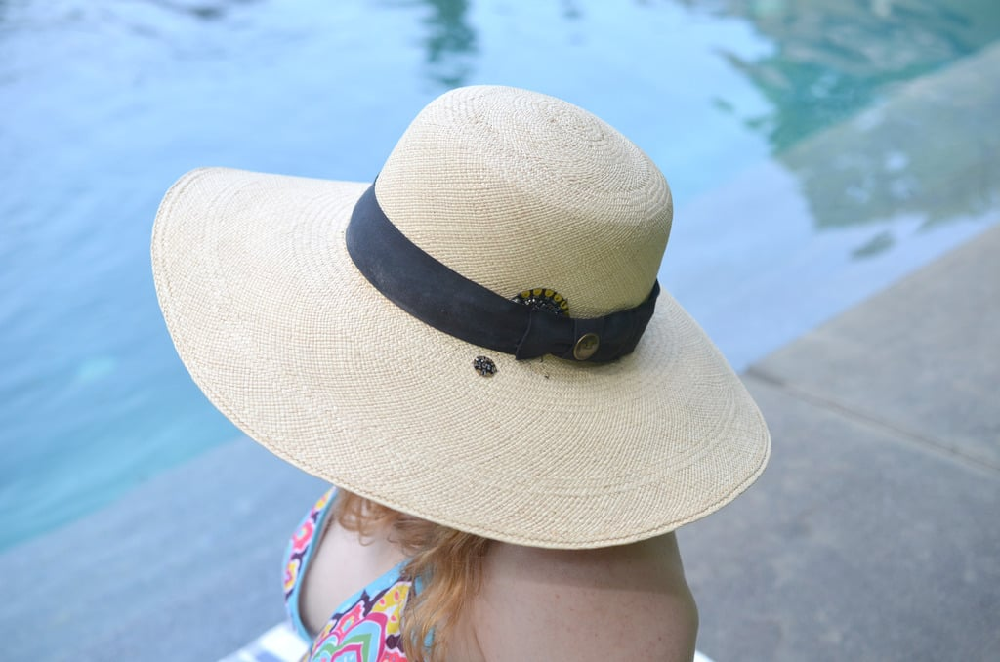
Source: [https://learn.adafruit.com/sunscreen-reminder-hat/overview](https://learn.adafruit.com/sunscreen-reminder-hat/overview) (Accessed: 01.09.2025)

#### QSun
QSun is a wearable that helps users track the UV index that they are exposed to with an app and sends alerts if they stay in the sun for too long. As our project uses an app for more insights in the UV exposure and other features, the QSun app is an inspiration for the realisation for it. QSun does include many more features like a Vitamin D tracker, that our project will not include.

Source: [https://www.kickstarter.com/projects/comfable/qsun](https://www.kickstarter.com/projects/comfable/qsun) (Accessed: 03.09.2025)

#### Sunfriend
Sunfriend is another project we use as inspiration. The Sunfriend wristbands are wearables that track the users UV index and indicate the time a user should reapply sunscreen. The wristbands design is simple and tells the user the necesarry information in an efficient way. The simplistic design can be used in the design of the RayMinder caps, as the user should be able to identify the most important information - if they or a friend need to reapply sunscreen and the location of their friends - efficiently. 
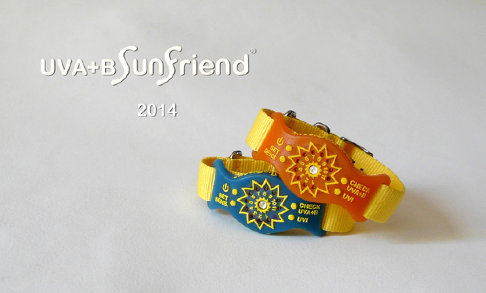
Source: [https://newatlas.com/sunfriend-uv-wristband/29979/](https://newatlas.com/sunfriend-uv-wristband/29979/) (Accessed: 03.09.2025)

#### Totem Compass
For the friend locating function, the Totem Compass is an inspiration. The Totem Compass is worn like a necklace and indicates where friends are located with colors pointing to them. The Totem Compass was invented specifically for festivals where friend groups get split up and have difficulties finding each other again. A similar concept applies for the RayMinder caps. They are made for groups in situations where they don't constantly look at their phones - like music festivals. The color location indication of the Totem Compass will be integrated in the RayMinder app in form an indication in the friend's direction. On the cap itself, the location will be indicated by haptic buzzers that go off in the friend's direction if a friend needs to be reminded to reapply sunscreen.
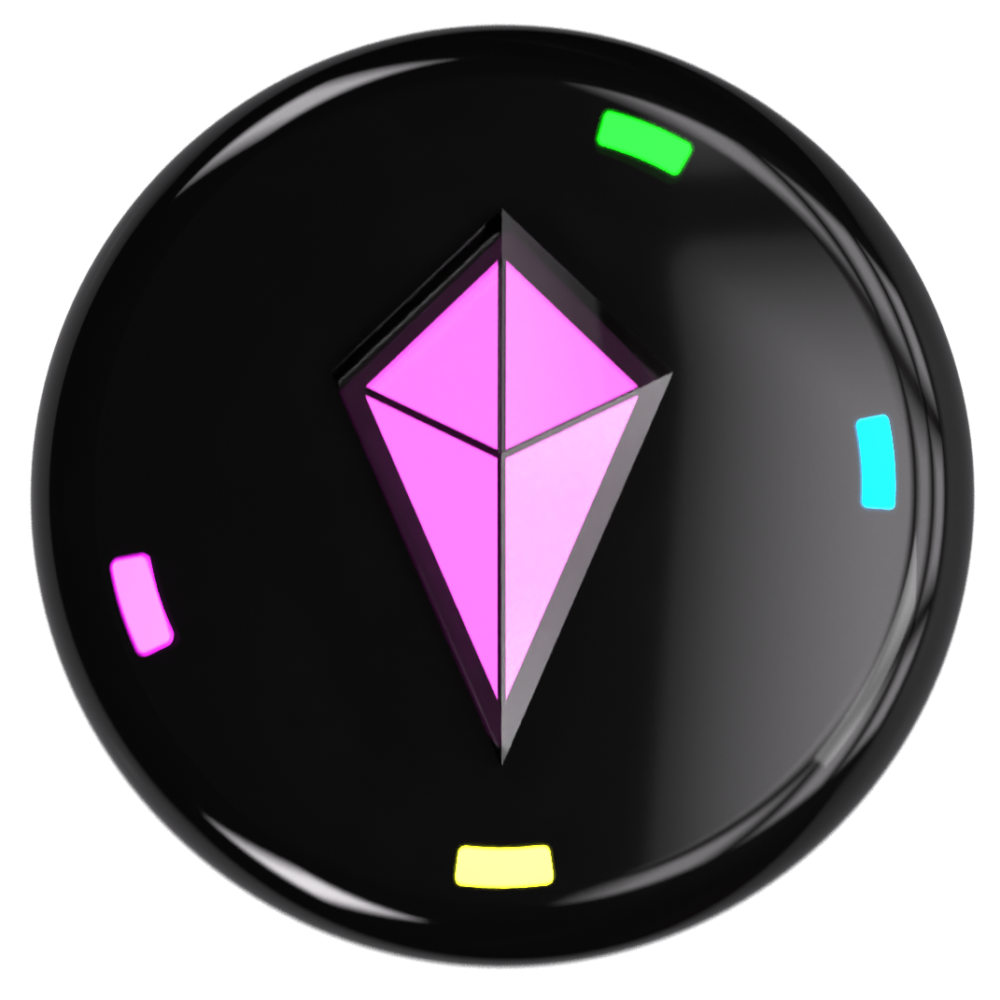
Source: [https://www.totemlabs.com](https://www.totemlabs.com) (Accessed: 03.09.2025)

### Design
#### General Design
The RayMinder caps are a combination of a wearable in form of a physical cap with a UV sensor and haptic buzzers, and an app connected to it. The RayMinder caps are each made out of the following materials: 1 cap, 1 ESP32-C3 Zero, 1 UV sensor, 1 Compass, 4 haptic buzzers, 1 battery pack and cables. All components but the UV sensor and the compass are hidden inside the cap. The UV sensor and compass are located on top of the cap for a most accurate data generation. Additionally a phone is needed.
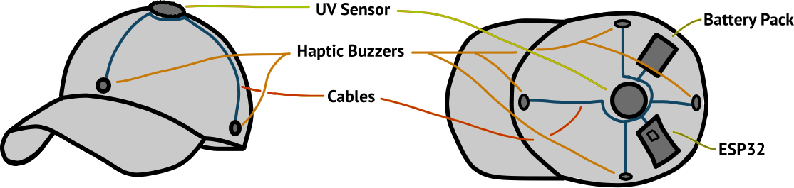

Each cap is connected to an app. The app design is the following:
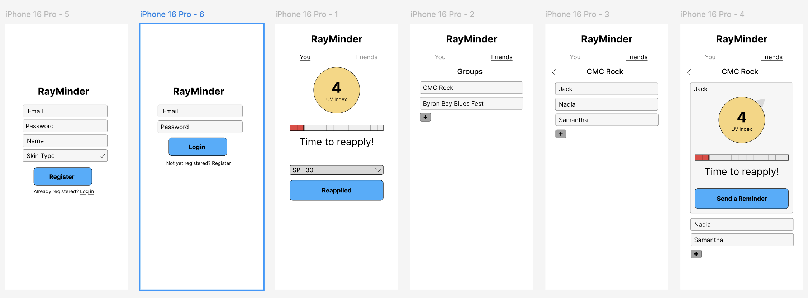
Users can register themselves. In the app there are two main tabs: You and Friends. The You Tab shows the UV index, the user is currently exposed to, a bar showing when to next reapply sunscreen with a motivational text, and a button to reapply sunscreen with a dropdown menu for different SPFs.

In the Friends tab, users can add or select a group and in that group they can see the different members. For the different members, they can also see the UV index, and a button that send a reminder to that friend.

#### Possible Design Variants
##### In-App Buttons only
One variant of the design could be that the button to tell the app that you have applied sunscreen is only virtually in the app. This is the approach that we have decided on so far. But we are open to other design variants, as a virtual-only button could result in negative effects on the user experience. For that we have to outweigh the pros and cons of each design.

<ins>Pro:</ins> No unwanted pressing of buttons. User can select SPF that they have applied.

<ins>Con:</ins> User has to go on phone, open app and press button, while having oily hands from the freshly applied sunscreen.

##### Physical Button
The button for reapplying sunscreen can also be added as a physical button to the caps. The button should be positioned somewhere where it won't be pressed by accident easily.

<ins>Pro:</ins> User doesn't need to get phone out.

<ins>Con:</ins> Button can be pressed accidentally. User can't select what SPF was applied.

##### Visual Feedback
Instead of or additionally to the haptic feedback, the cap could have LED stripes integrated, that show the user visually, when they have to reapply sunscreen. For the user to see it themselves, the LEDs have to be integrated in the front of the cap.

<ins>Pro:</ins> Can be less anoying than haptic buzzers. Status can be checked at any time without looking at phone; not just the reminder.

<ins>Con:</ins> Has to be bright enough for it to be usefull in daylight. Too much light in vision can be anoying.

##### Positioning of the Hardware Components
In the design phase, we thought that we have to place all of the components on the outside of the cap, since it would not be possible to attach them inside the cap, without them looking terrible, feeling irritating or even falling off. We were able to change the plan, when we saw that the cap we bought has a wide seam inside, in which we can hide most of the modules. With this, the RayMinder caps look way more professional from the outside. The only parts, that still had to be placed outside of the cap, were the UV sensor and the compass to retreive reliable data. 

For the exact position of the components in the seam and around the cap, we tried out multiple variants. First we wanted to place the buzzers in the front, back, and the two sides. With there being no seam in the back of the cap, we instead put the buzzers in the diagonals. For the positioning of the ESP32 and the battery pack, we first thought that it would be best to put them on one side to have less long cables. But as this would make the weight of the cap one-sided, we instead put the battery to the opposite side of the cap. The last position, that changed from the first idea, is the position of the compass. We wanted to place it directly below the UV sensor on top of the cap. When we assembled the actual hardware, we realized that this would look rediculous, as the two modules would stand up too far in a very visible position of the cap. So we had to find a new place for the compass, where it can be positioned parallel to the ground. For the later reason, we used the back of the cap. To be able to still adjust the size of the cap, the compass is placed in the valcro.

## Development - Phase 1 (Task 2)
We started the development of the RayMinder together with developing the concrete idea and a first app design. For the actual development of the app and the hardware we split tasks for a more efficient process. As Jofel has never worked with microcontrollers, but has experience with creating websites, she is responsible for most of the software of our project. As I have previously worked with microcontrollers before, my focus is the hardware. For this reason, the process journal will focus more on the devolpment of the hardware components and the connection to it.

### Idea Development
The first phase of development was finding the idea itself. I had the idea of a UV cap in my mind for longer, as I think it is a very useful product. As research showed that similar product already exist on the market, I thought about how that product could be used in a bigger context. In that I remembered the Totem Compass (see section Similar Projects), that I saw on TikTok. Together as a group, we worked on a possible realization of a combination of the two products.

### First App Design
Once the idea was ready, we started working on a first design of the app. We thought about what the app should show and which buttons with functionality it should include. We drew a few sketches on paper. 

We though about how to create groups. The solution that seemed best fitting for us, is to register users with their email. Users also have to add their skin type when registering. This is needed for the recalculation of when to apply sunscreen. We thought about putting that option near the reapply-button, but since this attribute doesn't change it is better suited in the register process. For more simplicity we ended up using usernames and an SPF and skintype dropdown on the page of the reapply button.

The idea of having two main pages in the app, one for the user themselves and one for friends, came to our minds instantly as these are the main interactions with the RayMinder caps. For how to navigate between the two pages, we first thought about a hamburger menu to change the pages. We settled on a tab layout as users can switch between tabs faster than if they have to open a menu first. The app also doen't include too many informations on one page, so the constant inclusion of the tabs doesn't make it too crowded.

For the group page, the user starts at a list of all groups they are in in, as the user should be able to be in multiple friend-, and with that RayMinder-, groups. By clicking on one group, the app navigates to the group with a list of all members. By clicking on a member, that member card gets larger, exposing a detailed view similar to the You-page. We thought about adding an extra page for the single view, but making the cards switch sizes makes navigating to other friends faster. With that the user can check the UV status of all their friends more efficient.

After we decided what designs worked best, we created a first design draft in figma. This will help us in the realization of the actual app later in the process. 

## Development - Phase 2 (Task 3)
After we had figured out most of our design, we started with the realisation of the project. While Jofel worked on the webapplication as described above, I started working on the hardware.

All ESP32 programms are located in [https://github.com/jofelguevarra/RayMinderApp/tree/main/ESP32Scripts](https://github.com/jofelguevarra/RayMinderApp/tree/main/ESP32Scripts). The README file explains, which of the in the following described scripts are located where in the repository. The code for the app can be found at [https://github.com/jofelguevarra/RayMinder](https://github.com/jofelguevarra/RayMinder).

### Test Programs for the Modules
#### Buzzers
As a first step in the development of the hardware components, I wrote test programs to figure out if and how the different components work. For the buzzers, I wrote a simple code that turns a buzzer on a set pin on and off again. 
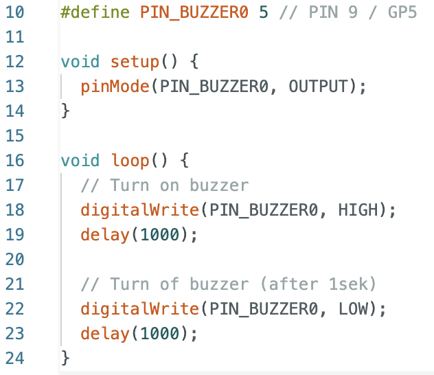

#### I2C Communication
The next "component" I tested was I2C communication. This will later be used for communication with a compass, but it was also very helpful for testing sending messages. Since I have not worked with I2C in a long time, I wrote a little program that turns the buzzer on, if a certain message was written in the Serial Monitor. This little exercise helped me understand how Serial input is handled again, and will help decode messages that are send from the phone to the microcontroller. 
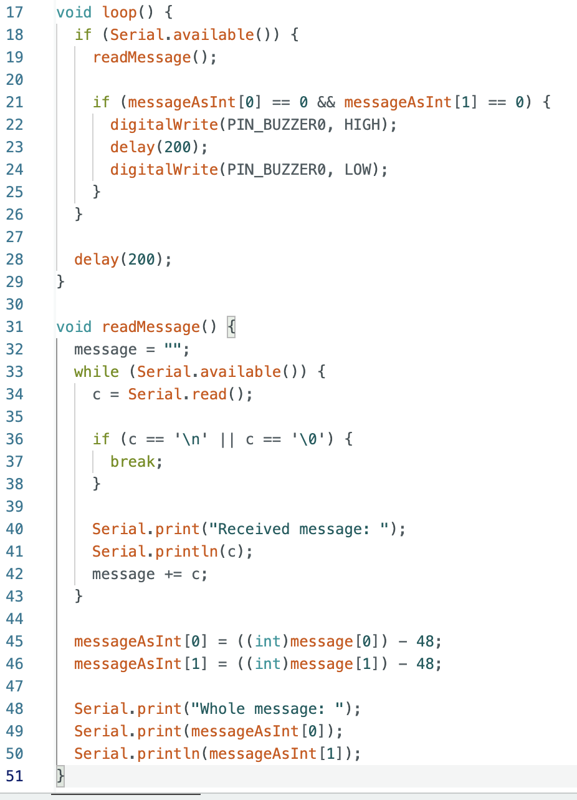

#### UV Sensor
Another main component of the RayMinder is the UV sensor. For this I first wrote a program that prints out the data that is received with an analogRead to get an impression of the data outputs.
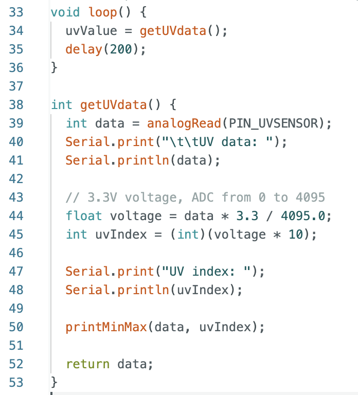

With a look into the documentation of the GUVA-S12SD UV sensor, I found out that the values go from 0 to 4095 and can be converted to the uv index by dividing the voltage by it and muliplying it with 0.1. I tested the resulting calculation by going back and forth between the sun and shadow and comparing the values to the uv index declared by the weather forecast.

After this worked, I continued with the question of how we are going to calculate the time of the next needed sunscreen application. This was the most complicated part of the code development and needed a lot of trial and error. 

I started with researching a possible calculation. There are six different skintypes. The different skintypes can stay in uv index 10 for 10, ~15, 20, 30, 60, and 90 minutes ([https://www.ker-sun.com/en-us/blogs/suncare-advice-prevention/what-is-your-phototype](https://www.ker-sun.com/en-us/blogs/suncare-advice-prevention/what-is-your-phototype), accessed 25.11.2025). The time a person can stay in the sun is proportional to the uv index ([https://www.grassrootshealth.net/blog/assessing-sun-exposure-skin-type-uv-index-duration/](https://www.grassrootshealth.net/blog/assessing-sun-exposure-skin-type-uv-index-duration/), accessed 25.11.2025). The amount of time a person can stay in the sun with sunscreen is the time without sunscreen multiplied by the SPD ([https://www.newswise.com/articles/expert-provides-sun-safety-tips-for-skin-cancer-awareness-month](https://www.newswise.com/articles/expert-provides-sun-safety-tips-for-skin-cancer-awareness-month), accessed 25.11.2025). As sunscreen application oftentimes is not perfect and with sweat and other factors, the protection wears off over time, a factor of 0.6 provides a more realistic time till the next reapplication ([https://www.barmer.de/gesundheit-verstehen/koerper/haut/lichtschutzfaktor-1268356, accessed 25.11.2025 and https://www.sciencedirect.com/science/article/pii/S0190962201584303](https://www.barmer.de/gesundheit-verstehen/koerper/haut/lichtschutzfaktor-1268356, accessed 25.11.2025 and [https://www.sciencedirect.com/science/article/pii/S0190962201584303](https://www.sciencedirect.com/science/article/pii/S0190962201584303)), accessed 25.11.2025). I integrated all of these calculation in my code.
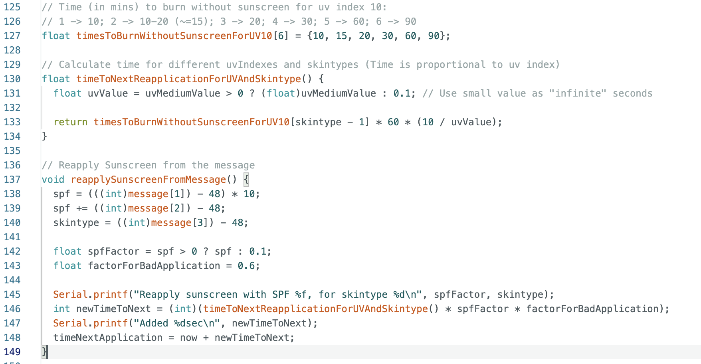

Now there was still the questions, when exactly to recalculate the time to the next application. For reapplying sunscreen, the possibilities where that the newly calculated time is added to the current next time to reapplicate or to overwrite the time completely. I went with the second solution, as if the same SPF is applied only after a few minutes, the time to the next reapplication would not just be readded, but just reset.

Another time when the time has to be recalculated is when the UV index changes. In the beginning I used the constantly changing uv value and tried to calculate it with a complicated calculation with calculating the fraction of the elapsed time. This approached only worked if the the uv value changed rarely. Additionally this approach was over-complicated.
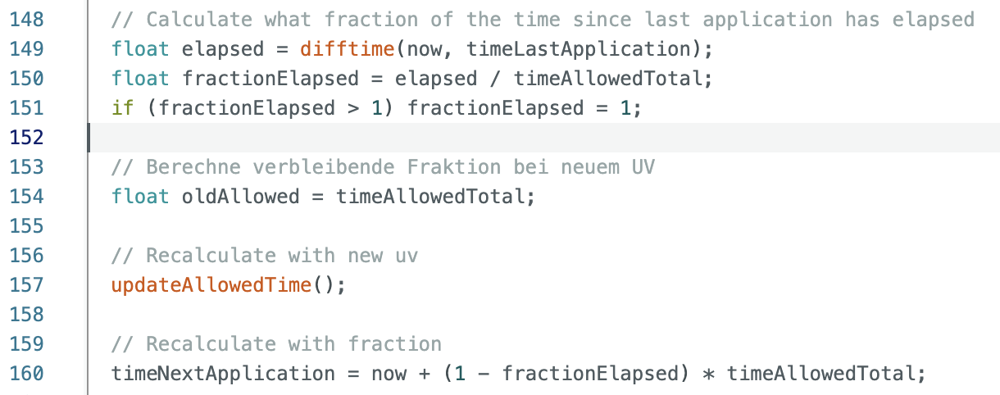

After some thinking, I found a new solution. Firstly, the UV value should not change with every newly received data. For example if the person quickly walks through the shadow of a tree, it does not make sense to recalculate the time for these few seconds. To solve this issue, I added the calculation of an average UV index.
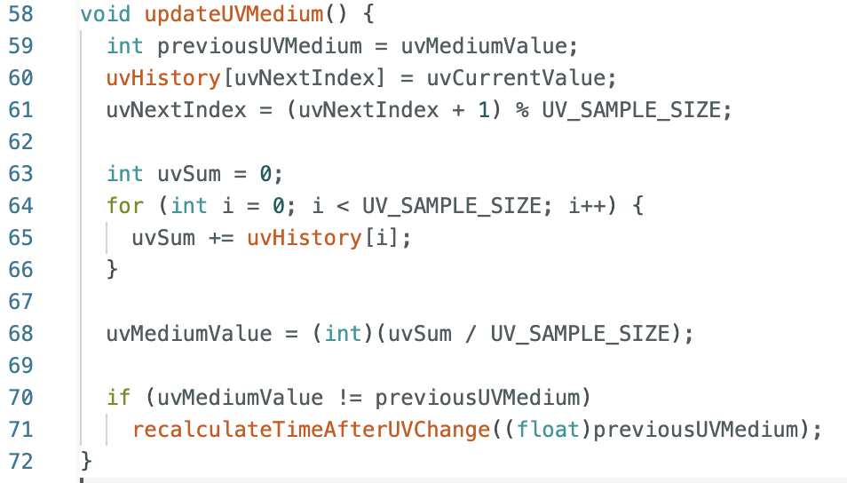

Secondy, since the time in the sun is proportional to the UV index, I added a calculation with this, instead of the complicated fractions. I tested all of these calculations with different sunscreen reapplications and UV values. 
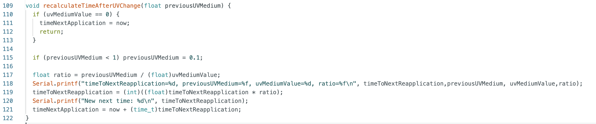

#### Compass
Lastly, I tested a compass which will tell us the direction a RayMinder cap is facing to activate buzzers in the direction of a friend. For this, we have the HMC5883L. Figuring out how to get the compass working was one of the harder tasks. To figure it out, I first tried out an example from the package Grove_3Axis_Digital_Compass_HMC5883L, which sounded the closest to what we need. The internally used I2C communication did not work with this example. As this did not work, I used the second closest package, Adafruit_HMC5883_Unified. This package is not for the specific sensor that we use, but it did give me plausible results, which is why I continued working with it. The example included in the package already showed how to get the degree in which the module is heading. 

With the example code, there was one problem: The direction is separated into the 3 axises, x, y, and z. With this, if the horizontal orientation was changed, the facing direction changed as well. To be able to use the compass in our project, I added that the heading degree is only saved if the compass is parallel to the ground, which is at about z=45. To make sure that the result is correct, I cross-checked it with my phone.

#### Communication with Phone via BLE
To connect the phone with the ESP32, I used BLE. For this I first wrote code to test how the connection works. After the connection was established, I added functions to the code of the ESP32, that send messages to the phone. The messages that are send are for the current UV value (average), the time of the last application, the time to the next application, and the degree the RayMinder is facing.
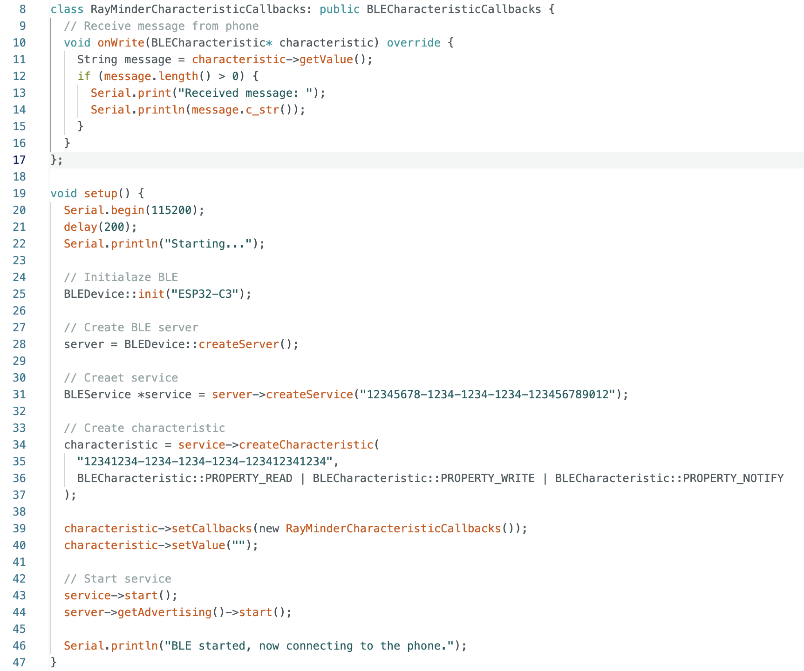

These messages are received in the code of the app. Jofel had already created a Dotnet app with screens for registering, login, the "You"-page, as well as a "Friends"-page. To successfully connect the phone with the ESP32, I extended the code. I added a button to the page, with which users can connect the ESP32 to the app. The following image shows the code, that is used for the connection.
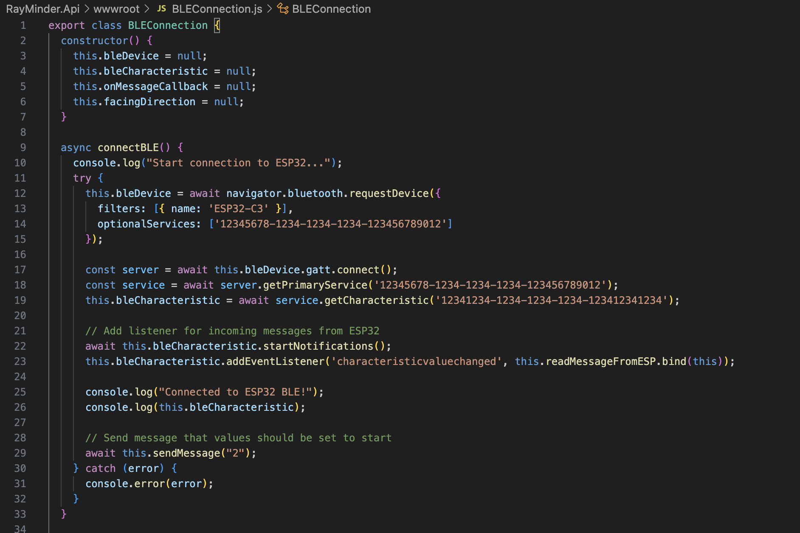
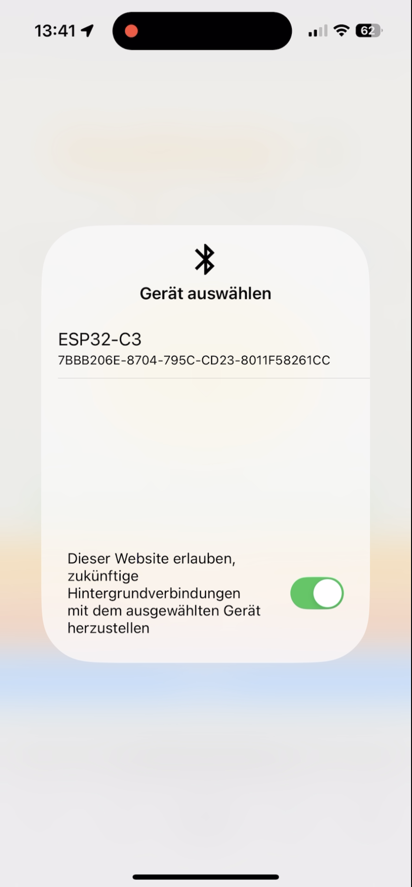

In general, for the messages, I created a coded messaging system, with which all messages are send in form of digits and decoded correspondingly. For example, to set the UV value to 3, the ESP32 sends the message "003" to the app. The leading digit, 0, stands for set UV value, the other digits for the UV value. 

I also added functions to the app, with which the app send messages to the phone, and messages can be received, decoded, and the fitting action is taken. The code of the app was also extended with a connect button, and messages that can be send to the ESP32 to tell it, that sunscreen was reapplied or that friends should reapply sunscreen.
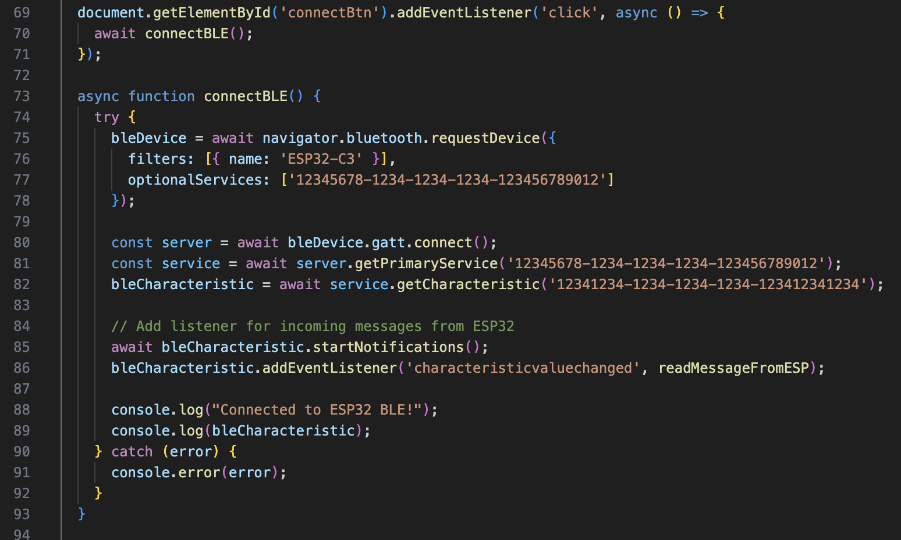
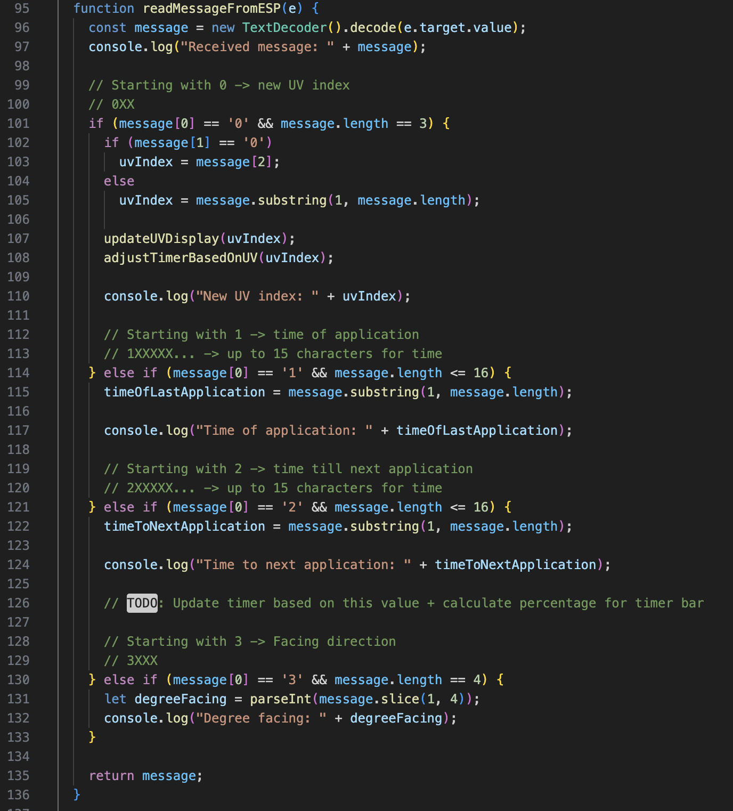

### Combining the Components into one ESP32 Script
Now all the components for the ESP32 have been tested and developed. The next step is to combine them into one script which will be uploaded to the ESP32. For this, I integrated each component one at a time and tested each integration. For easier testing, I used the Serial Monitor to simulate sending messages between the ESP32 and the app. Once all tests succeeded, I also tested the functionalities with the real app. As mentioned before, the script can be found at [https://github.com/jofelguevarra/RayMinderApp/blob/main/ESP32Scripts/RayMinder/RayMinder.ino](https://github.com/jofelguevarra/RayMinderApp/blob/main/ESP32Scripts/RayMinder/RayMinder.ino).

### Assembling the Hardware
So far, all the hardware was tested on a breadboard. Now it is time to actually assemble it. For that I soldered all cables to the ESP32 and the modules. This was an extensive task, with multiple cables breaking of that had to be re-soldered onto the construction.

One of the most frustrating issues I faced, was that I had to swap ESP32s two times, because I thought they were fried. In the end, the issue was probably that I was not able to use multiple pins of the ESP32 with the buzzers, as they are used in the startup process of the ESP32. Using these pins lead to the scripts sometimes not uploading to the ESP32, even though it looked like it worked in the Arduino IDE. Since the IDE did not show any issues, figuring out, that that was the reason, why my code did not run correctly was hard. In the end, it worked with using different pins for the buzzers and only attaching the UV sensor to the "forbidden" pins.

At the end of the soldering process, we were left with a lot of cables that had to fit in the seam of the cap. To make sure we could still move cables somewhere else, and in case a solder joint broke off, I made all cables a few centimeters longer than needed. If I had to do the assembling again, I would use a maximum one extra centimeter. In my experience with this prototype, that amount was enough for needed fixes. The long cables made it hard to push them inside the seam.

With two hands, tape, clamps, and neadle and thread, we still managed to put the cables into the seam as we were hoping. In the end, only the cables for the UV sensor and the compass were visible from the outside, which was inevidible. With all other cables hidden in the seam, the added electronics on the cap of the RayMinder are not very noticable - which was our goal.

## Result

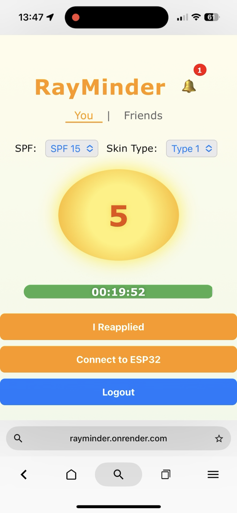

In the end of our development, we now have a working RayMinder. The RayMinder can successfully collect UV data and calculate the next time that the user has to reapply sunscreen. For that, a delibarate calculation was used that is ran at the start of a connection to an ESP, once the reapply-button is clicked, and once the UV value changes. The ESP32 and the connected phone communicate via BLE. For this reason, to use the app, an additional app like nRF Connect has to be installed to connect the ESP32 to the phone, and the Browser Bluefy has to be used on an iPhone. The app is a Dotnet webapplication that can be found here: [https://rayminder.onrender.com](https://rayminder.onrender.com). Once the time till the next reapplication has run out, the user gets reminded to reapply sunscreen with all four buzzers going off in the RayMinder cap.

The ESP and the app both already feature functionality that make it possible that when a user's friend needs to reapply sunscreen, a buzzer in the direction goes off. As we only created one RayMinder prototype, this functionality was not tested yet.

In general, we are proud of the result. We managed to create a working prototype that looks professional. As the RayMinder is a very useful wearable, that combines individual safety and a social component, this might be a project that I will continue to work on in the future.
